# PROJECT Design Documentation

## Team Information
* Team name: Team 3 - we're better
* Team members
  * Caiden Williams
  * Sean Droll
  * Grady Lilley
  * Jayda Hutchinson
  * Toni Butler

## Executive Summary

This project is a website that prompts the user to first login. If they give a user's username the user is presented a list of needs. They can search through this list of needs and add any to their basket. They can then go through a checkout process and "pay for the" needs in the basket. Every time a unique user “pays” for a need a count of helpers is increased for that need. The user may also change their username or password on the settings page. Alternatively; if given an admin username, the admin is also presented with a list of needs they can search through. However, instead of adding them to a basket, the admin can edit, add, or remove any of the needs. 

### Purpose

The purpose of this project is to create a funding website for a tree planting organization that we’re calling “Arboreal Acquisitions”. The site will have a user side that allows users to help fund the organization and an admin side so that officials of the organization can manage what needs/areas show up to the users.

### Glossary and Acronyms

| Term | Definition |
|------|------------|
| UI | User Interface |
| ID | Identification |
| MVP | Most Valuble Product |
| DAO | Data Access Object |
| Single-Responsibility Principle | A design principle where a module is assigned to just one section of a project |
| Information Expert Principle | A module should only have functionality for information it can access |

## Requirements

This section describes the features of the application.

User functionality:
 * Add to a basket from a list of needs
 * Search through a list of needs
 * Checkout the basket of needs
 * Remove from the basket of needs
 * User Authentication
 * See the number of helpers for each need
 * Account Settings: Edit/Delete Account

Admin functionality:
 * Edit any need
 * Add any need
 * Remove any need
 * Can see number of helpers for each need

Other:
 * Everything is saved to files

### Definition of MVP

The project gives the user a list of needs that can be searched through 
and any need can be added to their basket. A basket that can be viewed
and edited in the checkout page. Each user has the ability to "purchase" their 
basket. It also gives the admin a list of needs that can be edited, 
added to, or removed from. 

### MVP Features

* Accounts/Authentication
* Cupboard for users to view/add needs to their cart and see all needs
* Checkout basket that can be viewed, added to, or removed from
* A search bar for users and admins to search for specific needs
* Admin functionality: Edit/Add/Remove a need

### Enhancements

* Login (User/Pass)
* Registering an account
* Account settings (change user/pass or remove account)
* A count for each need that shows how many users helped it

## Application Domain

This section describes the application domain.

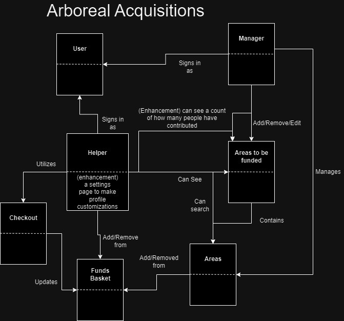

As seen in the diagram everything starts with either being an admin or a user. The user
can use the checkout and basket, and see the list of needs. The manager can edit the 
list of needs and manage the areas.

## Architecture and Design

This section describes the application architecture.

### Summary

The following Tiers/Layers model shows a high-level view of the webapp's architecture. 

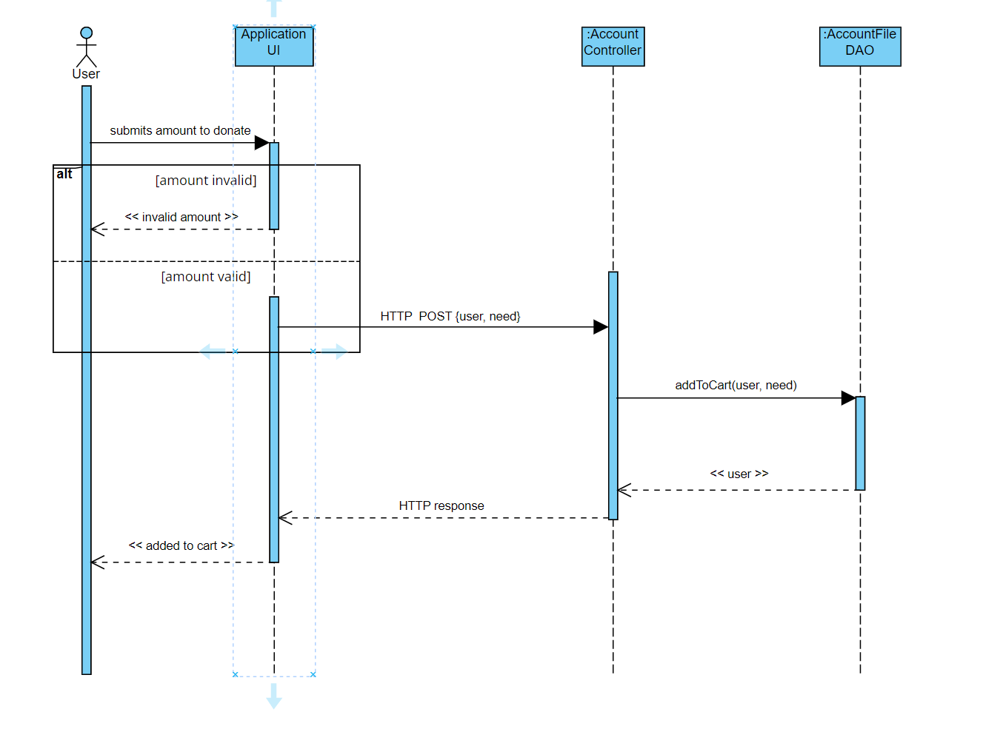
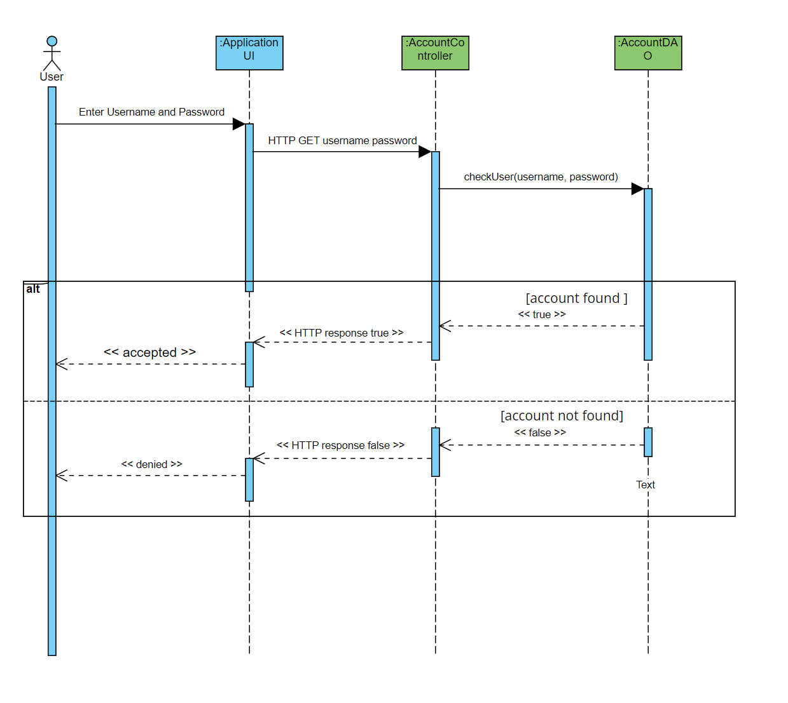
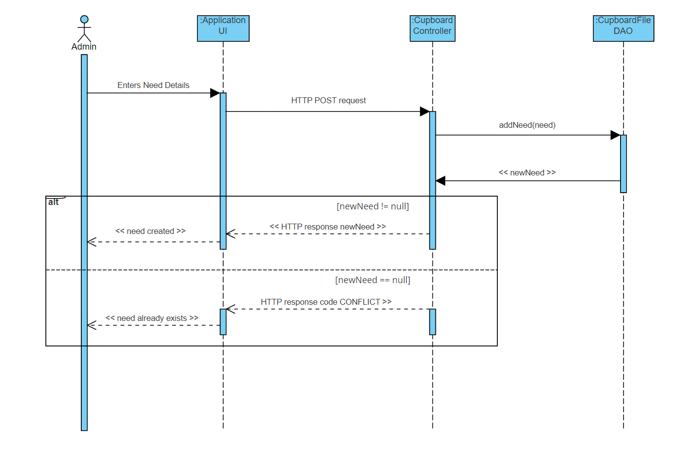

The web application, is built using the Model–View–ViewModel (MVVM) architecture pattern. 

The Model stores the application data objects including any functionality to provide persistance. 

The View is the client-side SPA built with Angular utilizing HTML, CSS and TypeScript. The ViewModel provides RESTful APIs to the client (View) as well as any logic required to manipulate the data objects from the Model.

Both the ViewModel and Model are built using Java and Spring Framework. Details of the components within these tiers are supplied below.

### Overview of User Interface

This section describes the web interface flow; this is how the user views and interacts with the web application.

The user will first be greated with a login page. There they can login if they already have an accout or regester an account. Once done so, they will be brought to the main page of the website that displays the list of needs, a checkout button, a search bar to search through the needs, and a logout button. After they have added some needs to their basket, they can then go to the checkout page and checkout the needs. Afterwards they will see changes to each of the needs purchased. They can also go to their settings page where they can edit/delete their account.

### View Tier

The view consists of a bunch of different components that work together to make everything work. There is an admin component that holds all of the admin UI functionality, a login/authentication component for the login UI. A need component for all the need UI functionality. A cupboard for the cupboard UI. A registration component for the registration UI. Finally, a user settings component for the user settings UI.

### ViewModel Tier

This is the controller component that connects the front end to the backend. In the backend there are two main files: the Account Controller and Cupboard Controller. They each call on their respective DAO file for the functionality and then return responses. Then the front end service files for a few of the components call on those functions from the controller to receive the backend responses.

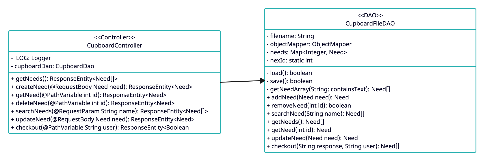
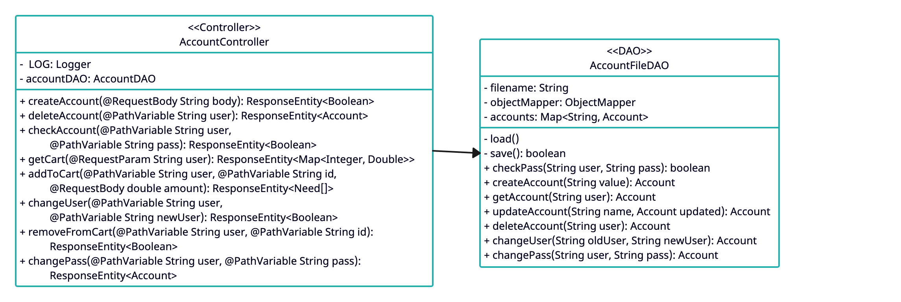

### Model Tier

There are two main files with the functionality, the Account DAO and the Cupboard DAO. The Account DAO covers all functionality for accounts; like login, create account, edit the account, and delete an account. The Cupboard DAO covers everything else; adding a need, getting the list of needs, editing a need, deleting a need, searching for a need, and checking out. Each DAO uses the model classes 

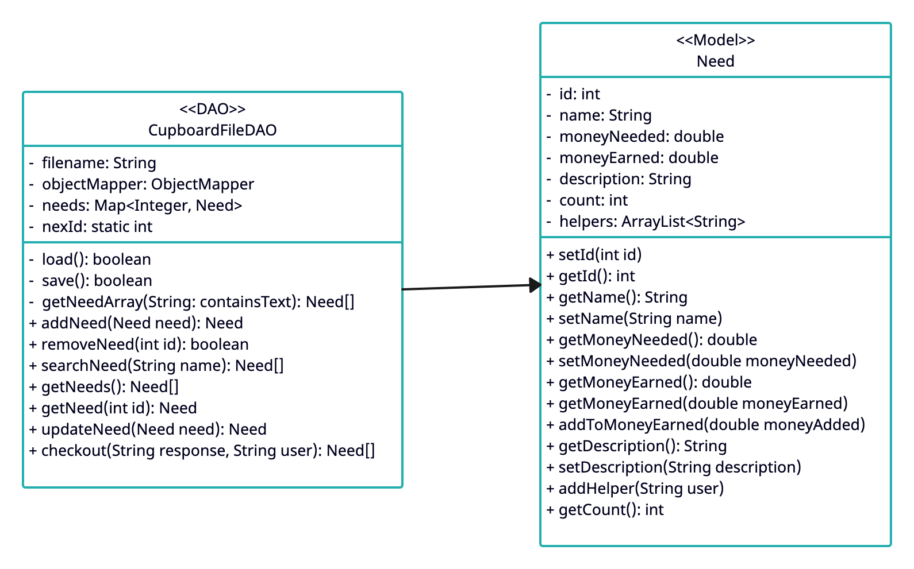

## OO Design Principles

1. We used the **Single-Responsibility Principle** as seen in the model tier of our system. We have two models, an Account and a Need model. Each with their own specific functionality. And then the Cupboard DAO and Account DAO implements the functionality for both models. (See Model Tier for diagrams)

2. We used the **Information Expert Principle** as seen in our models and DAOs. Each model and DAO only implements functionality for information directly accessable to it. The model only sets and gets data set directly in each and the DAOs only inplement functionallity for each respective model. (See Model Tier for diagrams)

3. We used the **Controller Principle** by creating little connection between the frontend (UI) and backend (api) by creating a controller class that takes in all input, calls all functionallity from the backend, and then returning the output from the backend. (See ModelView Tier for diagrams) (to be done in sprint 4)

4. We used the **Open/Close Princible** by creating two seperate components for the manager needs and cupboard needs. If we didn't there would be a bunch of different extra, unnecessary lines of code that we avoided. This way, we could easily just create specific functionallity for each list instead of trying to create some abstract class for each. (See View Tier for diagrams) (to be done in sprint 4)

## Static Code Analysis/Future Design Improvements

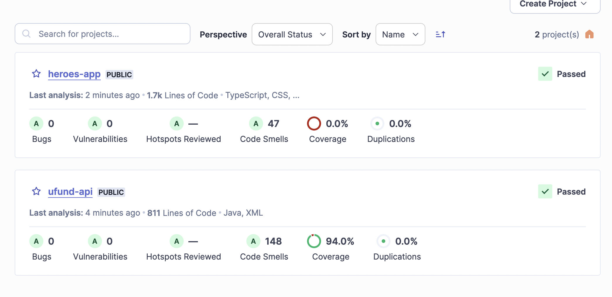

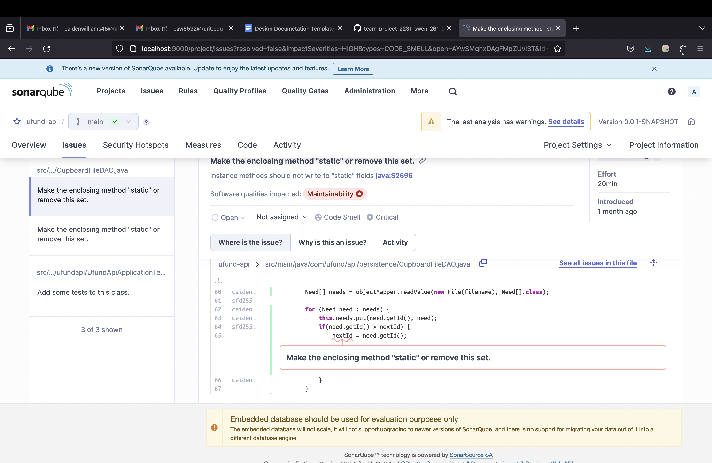
The issue shown here is that a static variable (nextId) is being set in a non-static method. This can be an issue because changing a static variable in a non-static method can cause bugs. To remedy this in the future or in future projects we believe that we could get around this happening by having a separate static set method for nextId. This way we are only changing the static variable in a static context without having to mess with our original method.

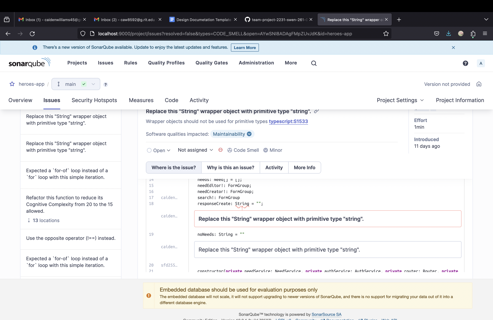
This is showing one of the many flags for our string variables. This isn't inherently an issue however it means that were including a lot more functionality than necessary. In the future we can easily change all of these to be string values instead

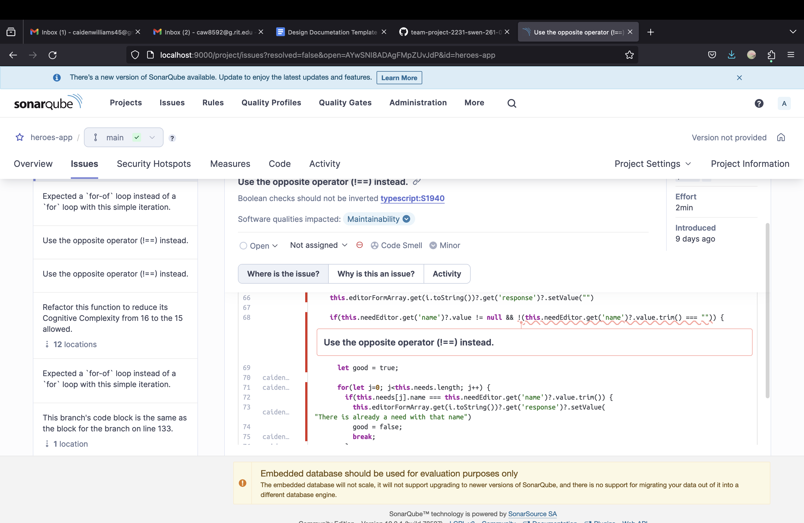
This issue outlines a segment we coded with strange syntax where instead of using != we negate a whole statement. We can easily go through and change all of these occurrences to make the code easier to read and cause less bugs.

# Code Design Improvements

* We could implement another file for each controller that would have held each controller function's functionality
* We could be more mindful of our usage of static variables and used less global variables and adding local variables 
* The code could have been broke up into more functions and files to make the code more readable and efficient

# Usability Design Improvements

* We could make website look more professional, and take much more time in css
* Quality of life settings are a good way to keep a user coming back to a website, the more personalized theyre side is the more they 
  can feel part of the cause
* The ability to select region not only allows an easy way to help areas close to you that may matter more to a user but also tells 
  you where you could go to help efforts of planting trees, this functionality could be teamed with an events tab like some other groups had added which allow users to come plant trees in person
* An about us page is  very common on non-profit websites, it is a fantastic way to become a little more personal with a user making 
  them care more about the cause
* Leaderboards can often tap into the competitive side of a user, if they see other people who had donated more than them they may 
  feel compelled to donate more like that user

## Testing

All testing preformed is in for the api. Every file has it's own tester file. Almost all functions and all functionallity for each function are tested. The model tests, test that things are set and got correctly. The DAO tests, test all functionality and if the function can fail and return null for false, the functionallity is tested. The controller tests, test all functionality, the failures (if applicible), and tests for any IOExceptions.

### Acceptance Testing

All user stories passed their tests for Sprint 3 (forgot to do for Sprint 2). And all bugs found during acceptance criteria testing were fixed and now pass their tests too.

### Unit Testing and Code Coverage

All testing preformed is in for the api. Every file has it's own tester file. Almost all functions and all functionallity for each function are tested (Read Testing Tab for more information on specifics). We achieved 92% coverage. We made our target 90% as that was the desired coverage for the project. We met the coverage and went 2% over. The only functions not tested were ones we couldn't figure out how to, but knew worked correctly through testing of the final product.

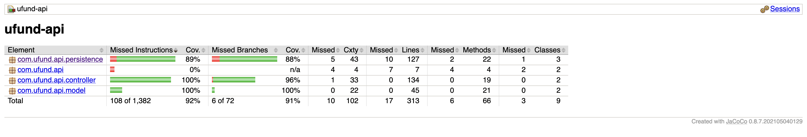
